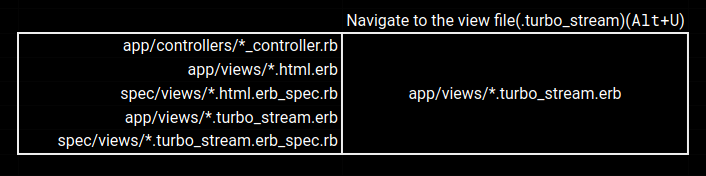

<h2 align="center">
   
  
  Navigate Rails Files

  
   
</h2>

The purpose of this extension is to navigate Rails files with the help of shortcuts.

- Template engines `.erb`, `.slim`, and `haml` are already supported for view files. They can be customized by changing `navigateRailsFiles.templateEngines` in the VSCode settings.

- RSpec is used for test files, but Minitest has not been supported yet.

- [ViewComponent](https://viewcomponent.org/) is supported out of the box. If [sidecar directories](https://viewcomponent.org/guide/generators.html#place-the-view-in-a-sidecar-directory) are being used, set `navigateRailsFiles.useViewComponentsSidecar` to `true`.
### Navigate to ruby files
Shortcut: <kbd>Alt</kbd> + <kbd>I</kbd>

### Navigate to files ending with `.html`
Shortcut: <kbd>Alt</kbd> + <kbd>O</kbd>

- Files ending with template engines (`erb`, `slim`, and `haml` as default or custom ones) are checked one-by-one.

- If there is no html file, a turbo_stream file is opened if it exists.

- So the order of checked files is as follows: `html.erb`, `html.slim`, `html.haml`, `turbo_stream.erb`, `turbo_stream.slim`, and `turbo_stream.haml`.

### Navigate to files ending with `.turbo_stream`
Shortcut: <kbd>Alt</kbd> + <kbd>U</kbd>

### Navigate to test files
Shortcut: <kbd>Alt</kbd> + <kbd>P</kbd>

## Extension Settings

This extension contributes the following settings:

* `navigateRailsFiles.allowToOpenRbFile`: Allows using the shortcut to open Ruby files ("true" by default).
* `navigateRailsFiles.allowToOpenAppHtmlFile`: Allows using the shortcut to open view (.html) files ("true" by default).
* `navigateRailsFiles.allowToOpenAppTurboStreamFile`: Allows using the shortcut to open view (.turbo_stream) files ("true" by default).
* `navigateRailsFiles.allowToOpenRspecFile`: Allows using the shortcut to open test (RSpec) files ("true" by default).

## How to Test the Extension Locally

- Press "F1" and select "Debug: Select and Start Debugging." Then select "Extension Tests."

## How to Use a Custom Version of the Extension

The extension can be customized by any developer easily. Please follow the steps below to use your custom version.

- Clone the repository.
- Run `npm install -g @vscode/vsce` to install [vsce](https://github.com/microsoft/vscode-vsce) if necessary.
- Customize any part of the project.
- Run `vsce package`.
- Open your VSCode.
- Press "F1" and select "Extensions: Install from VSIX." Then, select the generated file ending with `.vsix`.

## Authors

Reach out to us at one of the following places!

👤 **Hasan Özovalı**

- LinkedIn: [Hasan Ozovali](https://www.linkedin.com/in/hasan-ozovali/)
- Github: [@ozovalihasan](https://github.com/ozovalihasan)
- Twitter: [@ozovalihasan](https://twitter.com/ozovalihasan)

## Contributing 🤝

Contributions, issues, and feature requests are welcome!

Feel free to check the [issues page](https://github.com/ozovalihasan/navigateRailsFiles/issues).

## Show Your Support

Give a ⭐️ if you like the extension!

## License

- **[MIT license](https://opensource.org/license/mit/)**
